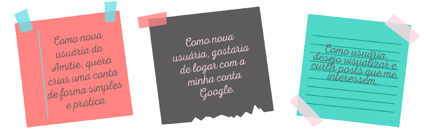
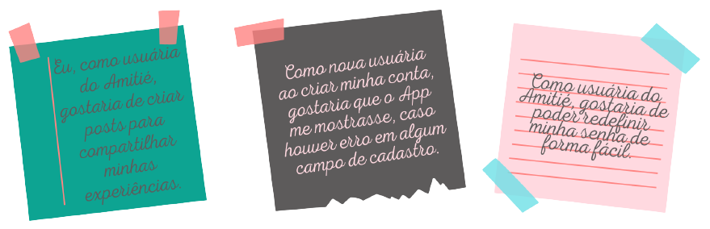
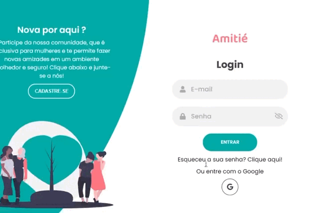
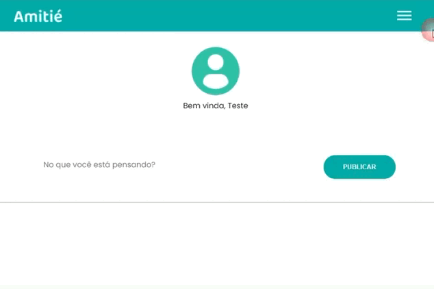
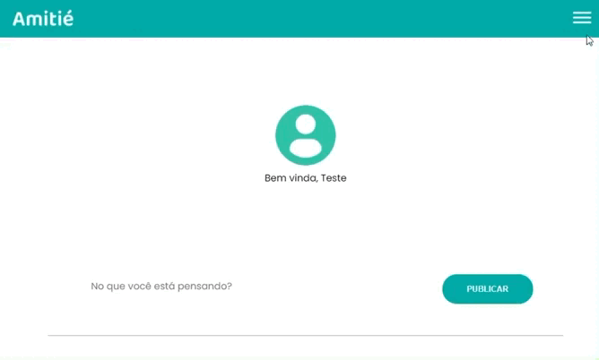
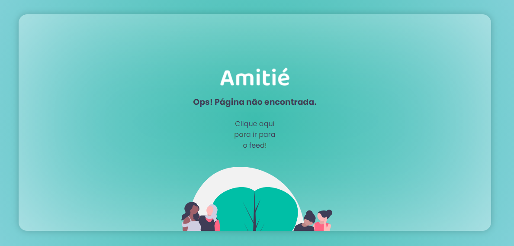

| :bust_in_silhouette: Demo User :computer: |
| --------------------- |
| :e-mail: Email: amitie@teste.com |
| :lock: Password: 123456 |

## :round_pushpin: Índice

- [1. Sobre o Projeto](#1-sobre-o-projeto)
- [2. Nossos Usuários](#2-nossos-usuarios)
- [3. Histórias de Usuário](#3-historias-de-usuario)
- [4. Aplicação](#4-aplicação)
- [5. Conteúdos Abordados](#5-conteudos-abordados)
- [6. Desenvolvedoras](#6-desenvolvedoras)

---

## 1. Sobre o Projeto  :computer:

A rede social _Amitié_ (do francês: amizade) surgiu da necessidade de conectar mulheres que queiram compartilhar suas vidas umas com as outras e fazerem
novas amizades. Nossas usuárias têm de 25 a 35 anos e é sabido que nessa faixa etária a probabilidade de fazer novos 
elos é baixa, visto que a maioria das amigas são do período da escola e/ou faculdade.  

Um estudo realizado pelas universidades de Aalto (Finlândia) e Oxford (Reino Unido) concluiu que 
nossos círculos de amizades atingem seu pico aos 25 anos. A partir daí começa uma queda vertiginosa 
que mantêm menos amigos quando entramos nos trinta. O problema não é apenas perdermos os contatos, 
mas também não os substituirmos. 

Pensando nisso, nós da _Amitié_, criamos um local seguro para as mulheres se conhecerem e compartilharem 
interesses entre si, sejam eles viagens, games ou até mesmo culinária. Um ambiente no qual possam formar
novos elos e contrariar qualquer pesquisa. 

Acreditamos <b>muito</b> que <b>_juntas somos sim mais fortes_.</b>:female_sign:

O projeto Social Network foi realizado no  _bootcamp_ da [LABORATÓRIA](https://www.laboratoria.la/br).

## 2. Nossos Usuários :dart:
O desenvolvimento de produtos e interfaces digitais a partir de uma ótica voltada para UX Design, deve levar 
em consideração os conceitos de Design Centrado no Usuário e, em seguida, estabelecer user personas que guiarão
as tomadas de decisão dos projetos.
Desta forma, criamos personas para melhor entendermos nossos usuários:
 
 

## 3. Histórias de Usuário :newspaper:

Depois de entender as necessidades de seus usuários, escreva as Histórias de
Usuário. Elas representam tudo o que ele precisa fazer/ver na Rede Social. Cada
uma de suas histórias de usuário deve possuir:

## 4. Aplicação :iphone:
<h2> :black_medium_square: Login e Cadastro </h2>

<h2> :black_medium_square: Esqueceu a Senha </h2>

<h2> :black_medium_square: Feed </h2>

<h2> :black_medium_square: Perfil </h2>

<h2> :black_medium_square: Not Found </h2>

## 5. Conteúdos Abordados :trophy:

O objetivo principal de aprendizagem deste projeto é construir uma [Single-page
Application
(SPA)](https://pt.wikipedia.org/wiki/Aplicativo_de_p%C3%A1gina_%C3%BAnica)
[_responsiva_](../../topics/css/02-responsive) (com mais de uma tela/ página) na
qual seja possível **ler e escrever dados.**

### HTML e CSS

- [HTML
      semântico](https://developer.mozilla.org/pt-BR/docs/Glossario/Semantica)
- [CSS `flexbox`](https://css-tricks.com/snippets/css/a-guide-to-flexbox/)

### DOM e Web APIs

- [Manipulação do
      DOM](https://developer.mozilla.org/pt-BR/docs/DOM/Referencia_do_DOM/Introdu%C3%A7%C3%A3o)
- [History
      API](https://developer.mozilla.org/pt-BR/docs/Web/API/History_API)
- 
  [`localStorage`](https://developer.mozilla.org/en-US/docs/Web/API/Window/localStorage)

### Javascript

- [Uso de
      callbacks](https://developer.mozilla.org/pt-BR/docs/Glossario/Callback_function)
- [Consumo de
      Promises](https://scotch.io/tutorials/javascript-promises-for-dummies#toc-consuming-promises)
- Uso de ES modules
      ([`import`](https://developer.mozilla.org/en-US/docs/Web/JavaScript/Reference/Statements/import)
      |
      [`export`](https://developer.mozilla.org/en-US/docs/Web/JavaScript/Reference/Statements/export))

### Firebase

- [Firestore](https://firebase.google.com/docs/firestore)
- [Firebase Auth](https://firebase.google.com/docs/auth/web/start)
- [Firebase security rules](https://firebase.google.com/docs/rules)
- [Uso de
      onSnapshot](https://firebase.google.com/docs/firestore/query-data/listen) |
      [onAuthStateChanged](https://firebase.google.com/docs/auth/web/start#set_an_authentication_state_observer_and_get_user_data)

### Testing

- [Teste unitários](https://jestjs.io/docs/pt-BR/getting-started)
- [Testes assíncronos](https://jestjs.io/docs/pt-BR/asynchronous)
- [Mocking](https://jestjs.io/docs/pt-BR/manual-mocks)

### Git e Github

- [Colaboração pelo Github](https://docs.github.com/pt/github/setting-up-and-managing-your-github-user-account/managing-access-to-your-personal-repositories/inviting-collaborators-to-a-personal-repository)
- [Organização pelo Github](https://docs.github.com/en/issues/organizing-your-work-with-project-boards/managing-project-boards/about-project-boards)

## 6. Desenvolvedoras :construction_worker_woman:  

### :woman_artist: Lana 
[GitHub](https://github.com/lanizia) [LinkedIn](https://www.linkedin.com/in/lanamsouza/)

### :woman_artist: Laura
[GitHub](https://github.com/lathne) [LinkedIn](https://www.linkedin.com/in/laura-tn/)

### :woman_artist: Liziane
[GitHub](https://github.com/lizianegarcia)  [LinkedIn](https://www.linkedin.com/in/lizianegarciadarosa/)
